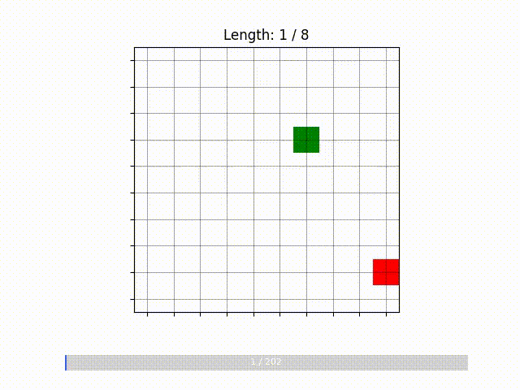
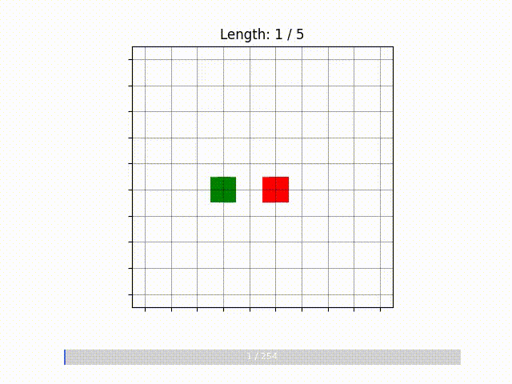
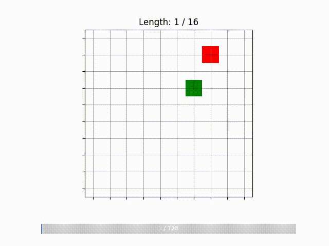
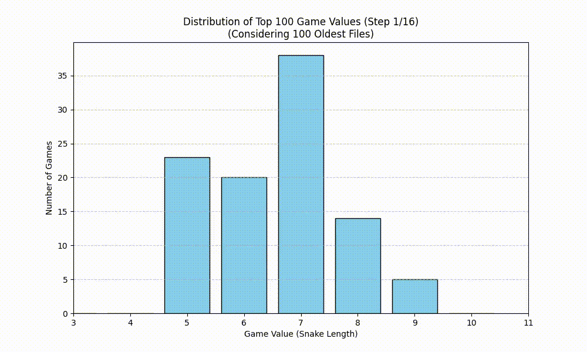

# AlphaZero Snake Game

  

이 프로젝트는 AlphaZero 알고리즘을 Snake 게임에 적용해, 데이터가 없는 상태에서도 명확한 규칙을 바탕으로 데이터를 생성하고 학습하는 과정을 체험하기 위해 진행되었습니다.

AlphaZero는 바둑, 체스처럼 규칙이 정의된 환경에서 자가 학습으로 최적의 전략을 찾는 강화학습 알고리즘으로, MCTS(Monte Carlo Tree Search)를 활용하여 다음 행동을 탐색하고, 정책과 가치 네트워크를 동시에 학습합니다.

---

## 개요

본 프로젝트는 AlphaZero의 학습 원리를 간단한 Snake 게임에 적용하여, 누구나 쉽게 이해할 수 있도록 하는 데 목적이 있습니다. 10x10 크기의 보드 위에서 움직이는 뱀이 스스로 학습하며 더 오래 살아남고 길이를 늘리는 행동을 보이도록 설계했습니다.

초기에는 아무 정보도 없는 상태에서 임의로 움직이지만, 반복 학습을 통해 최적의 경로와 먹이 습득 전략을 점차 익혀갑니다. 이를 통해 강화학습의 작동 원리와 AlphaZero가 가지는 강력한 탐색 및 학습 능력을 직관적으로 체감할 수 있습니다.

---

## 모델 구조

### 입력

모델은 보드 상태를 3채널 이미지 형태로 입력받습니다. 각 채널은 다음과 같습니다.

- 채널 1: 뱀의 머리 위치를 1로 표시한 이진 맵
- 채널 2: 뱀의 몸통 위치를 1로 표시한 이진 맵
- 채널 3: 먹이 위치를 1로 표시한 이진 맵

이렇게 표현된 상태는 뱀의 현재 위치와 먹이 위치를 명확히 전달하며, 모델은 이를 통해 학습하며 적절한 움직임을 결정합니다.

### 네트워크

- Residual Block 기반의 CNN 구조로, AlphaZeroNet이라는 자체 구현 네트워크를 사용했습니다.
- 입력 상태를 받아 정책(각 이동 방향의 확률)과 가치(현재 상태의 유리함 정도)를 동시에 출력하는 듀얼 헤드 구조입니다.
- 정책 헤드는 softmax 확률 분포를, 가치 헤드는 -1부터 1 사이의 값을 출력합니다.

### 출력

- **정책(Policy):** 상, 하, 좌, 우 중 진행 방향의 반대는 제외한 3방향에 대해 다음 행동의 확률 분포를 출력합니다.
- **가치(Value):** 현재 상태가 얼마나 좋은지 나타내며, 뱀의 길이를 기준으로 정규화된 실수 값으로 표현됩니다.

---

## 학습

### 1. 데이터 생성

- 모델 기반 MCTS를 활용해 셀프 플레이 데이터를 생성합니다.
- 초기 학습 전에는 임의 행동을 하며 데이터를 수집하지만, 학습이 진행됨에 따라 점점 더 전략적인 움직임을 하게 됩니다.
- 각 스텝에서 현재 상태(state), MCTS를 통해 탐색된 정책(policy), 게임 종료 시점의 가치(value)를 기록합니다.

### 2. 데이터셋 구성

- 수집된 데이터를 `SnakeDataset` 클래스로 관리하며, 정규화된 `(state, policy, value)` 튜플로 구성됩니다.
- 이를 배치 단위로 학습에 활용합니다.

### 3. 손실 함수 및 최적화

- 정책 손실은 CrossEntropyLoss로, 가치 손실은 MSELoss로 각각 계산합니다.
- 정책 손실과 가치 손실의 스케일 차이를 줄이기 위해 정책 손실에 가중치를 곱하여 균형을 맞추었습니다.
- Adam 옵티마이저를 사용하며, GPU 및 CPU 환경 모두에서 학습 가능합니다.

---

## 결과

  
  

학습이 진행됨에 따라 뱀의 움직임이 무작위에서 점차 효율적인 경로 탐색과 먹이 습득 전략으로 개선되는 모습을 확인할 수 있습니다.
초기에는 벽이나 자기 몸에 자주 부딪히지만, 수백 번의 셀프 플레이 후에는 보다 안정적으로 생존하며 길이를 늘리는 행동을 보입니다.
 

  

데이터도 더욱 안정적으로 생성되는 것을 확인할 수 있습니다. 학습이 진행될수록 더 높은 value의 데이터를 생성하도록 개선되어 나가는 것을 아래 그래프로 확인할 수 있습니다.

---

## 마무리

본 프로젝트를 통해 AlphaZero의 핵심 개념과 셀프 플레이 기반 강화학습의 원리를 직접 구현하고 경험할 수 있었습니다.
간단한 Snake 게임을 시작으로, 더 복잡한 게임이나 시뮬레이션, 실제 응용 분야에 도전해보고 싶습니다.
